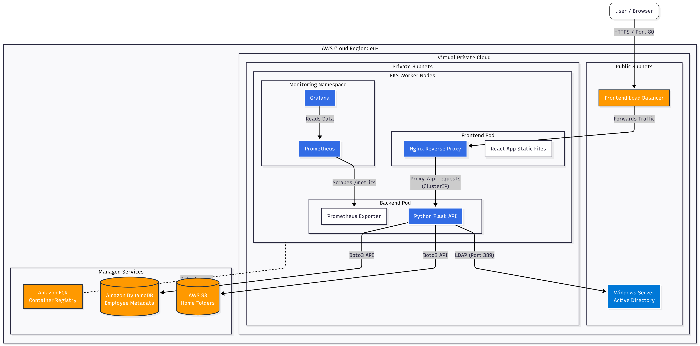

# Innovatech Hybrid Cloud HR Platform

This repository contains the source code and Infrastructure as Code (IaC) for a cloud-native HR onboarding platform. It is designed to automate employee lifecycle management using a Hybrid Cloud architecture, combining a modern Kubernetes-based application with a traditional Windows Active Directory for identity management.

## 🏗️ Architecture

The project is deployed on AWS using a layered Terraform approach, adhering to Zero Trust and network micro-segmentation principles.



* **Hybrid Identity:** Uses a Windows Server EC2 instance as a Domain Controller for Active Directory user management.
* **Micro-segmentation:** The Python Backend has no public IP and is only accessible via an internal Kubernetes Service through an Nginx reverse proxy.
* **Network Security:** Strict Security Groups ensure the Windows AD only accepts LDAP traffic from the EKS worker nodes.

## 🛠️ Tech Stack

* **Frontend:** React + Vite (Dockerized)
* **Backend:** Python Flask + ldap3 (Dockerized)
* **Infrastructure:** Terraform, AWS EKS, EC2 (Windows/Linux), ECR, S3, DynamoDB
* **CI/CD & Automation:** Bash scripting, Docker Buildx
* **Observability:** Prometheus, Grafana, prometheus-flask-exporter

## 🚀 Getting Started

### Prerequisites
* AWS CLI (configured with appropriate credentials)
* Terraform (v1.5+)
* Docker
* `kubectl`

### Deployment
This project uses an automated deployment script to handle Docker builds, ECR pushing, and Terraform updates.

1.  **Build the Platform (Layer 1):**
    ```bash
    cd infrastructure/01-platform
    terraform init
    terraform apply -auto-approve
    ```
    *Note: Wait ~15 minutes for the EKS cluster and Windows AD to be fully provisioned.*

2.  **Configure Kubectl:**
    ```bash
    aws eks update-kubeconfig --region eu-central-1 --name innovatech-eks-cluster
    ```

3.  **Deploy Applications (Layer 2):**
    Return to the project root and run the deployment script.
    ```bash
    ./deploy.sh
    ```
    The script will output the public URL of the Frontend Load Balancer upon completion.

## 💰 Cost Management

To minimize AWS costs during development, you can destroy the application layer and stop the Windows AD.